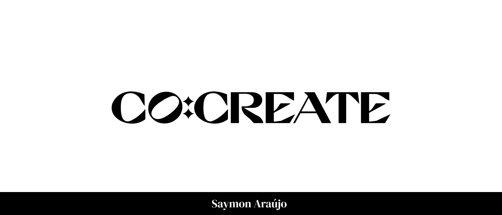
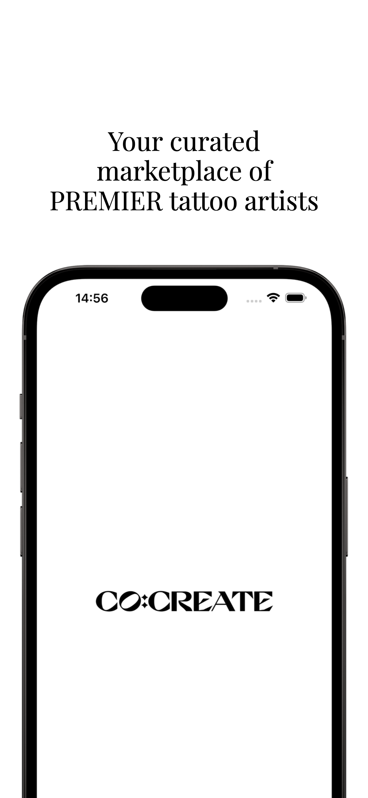
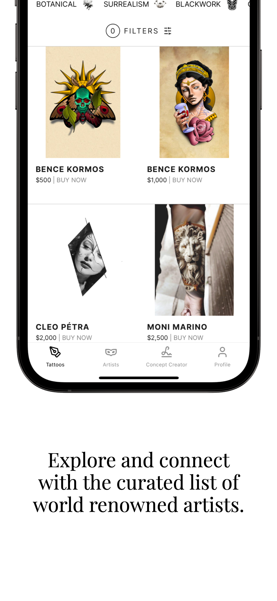
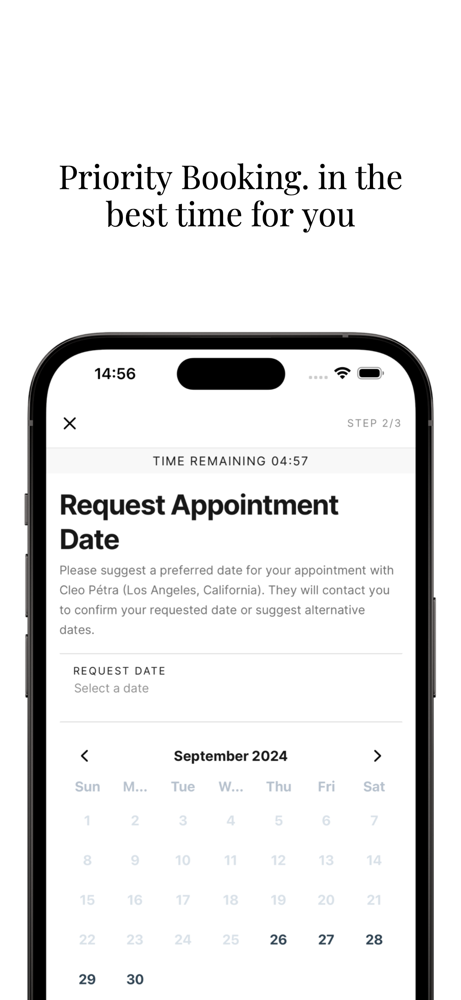
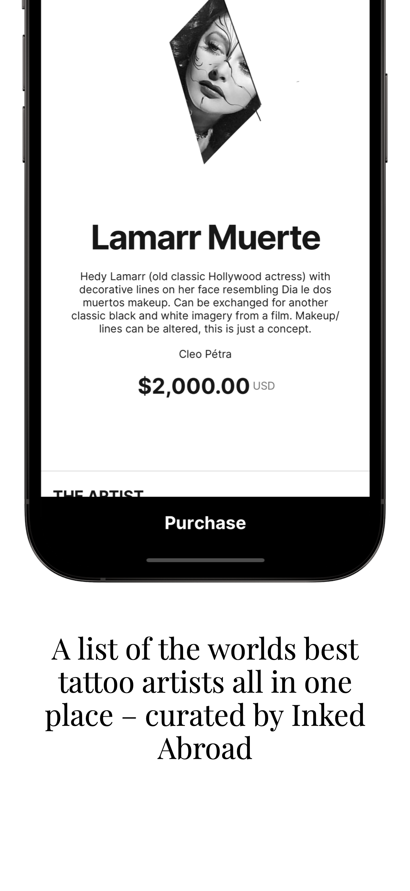

<h1 align="center">
    
</h1>

<h3 align="center">Your curated marketplace of premier tattoo artists</h3>

<p align="center">
 <a href="#description">Description</a> • 
 <a href="#technical-details">Technical details</a> •
 <a href="#features">Features</a> • 
 <a href="#how-to-use">How to use</a>
</p>

<br>
<br>

# Description
<p>This app was developed in 8 hours as a gift for the Co:Create Ink team. It reflects my expertise in building cross-platform mobile applications using modern technologies such as Expo, React Native, and Tamagui. This project aims to demonstrate how my technical skills can contribute to Co:Create's mission of merging technology with artistry in the tattoo industry.</p>


<div align="center" style="display: flex; justify-content: center; flex-wrap: wrap;">
 &nbsp;&nbsp;&nbsp;&nbsp;
 &nbsp;&nbsp;&nbsp;&nbsp;
 &nbsp;&nbsp;&nbsp;&nbsp;
 &nbsp;&nbsp;&nbsp;&nbsp;
</div>


<br>

# Technical details
<p>The project was developed using the following technology stack, ensuring scalability, cross-platform compatibility, and smooth user experience:</p>

- React Native: To provide a seamless user experience on iOS and Android with a single codebase.
- Expo: For rapid cross-platform development and easy over-the-air (OTA) updates and web support.
- Typescript: For ensuring type safety and reducing runtime errors by catching issues at compile time.
- Tamagui: This is for styling and optimizing performance while maintaining visual consistency across platforms.
- Expo router: For file-based navigation, allowing for a simplified and scalable routing system across the project. This approach makes it easier to handle routes in a large app with multiple views and features, such as artist portfolios or booking screens.

<br>

# Features

- [x] Tattoos List Page with FlashList to ensure performance for thousands of items
- [x] Form for Contact Information
- [x] Booking view with calendar
- [x] Checkout flow with timer
- [ ] Sign up and Sign in
- [ ] Stripe Integration

<br>


# How to use


1. Install dependencies

   ```bash
   npm install
   ```

2. Start the app

   ```bash
    npx expo start
   ```

In the output, you'll find options to open the app in a

- [development build](https://docs.expo.dev/develop/development-builds/introduction/)
- [Android emulator](https://docs.expo.dev/workflow/android-studio-emulator/)
- [iOS simulator](https://docs.expo.dev/workflow/ios-simulator/)
- [Expo Go](https://expo.dev/go), a limited sandbox for trying out app development with Expo
<br>
<br>

---

Made by Saymon Araújo
<div>
 <p> Feel free to get in touch, it will be a pleasure to chat.</p>
  <a href="https://www.linkedin.com/in/saymon-araujo/" target="_blank"></a>
  <a href="mailto:saymonbrandon@gmail.com?subject=Hello%20Saymon,%20From%20Github"></a>
  <a href="https://t.me/saymon_araujo_dev"></a>&nbsp;&nbsp;&nbsp;&nbsp;
</div>
